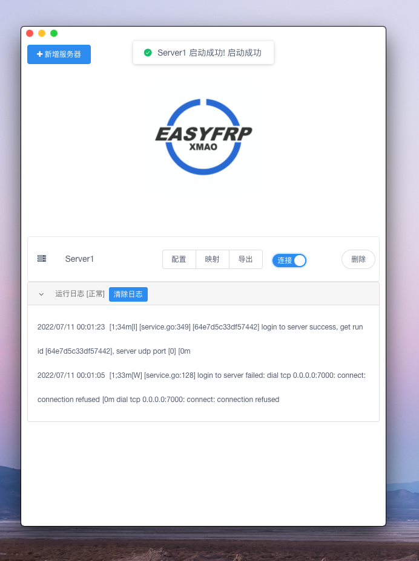

<h1 style="text-align:center">EasyFrp</h1>
  

一个跨平台的frp图形界面，基于Vue.js & Electron

 
 
现已实现基本功能：导入配置、添加映射、服务器管理、导出配置、随机映射名端口等。
 
Mac:

Linux(Deepin):

Windows:

### [2022-07-11] V1.0.1

- 增加导入功能

### [2022-07-10] V1.0.0

- 发布
